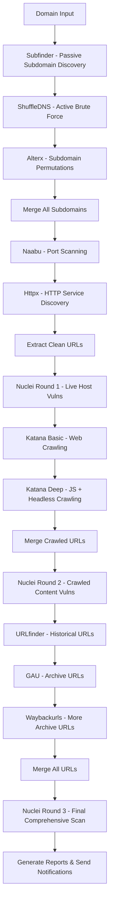

# 🔍 Bug Bounty Reconnaissance 

Automated reconnaissance  designed for bug bounty hunters and security researchers. This combines 10+ industry-standard tools in a strategic workflow to maximize vulnerability discovery and attack surface mapping.

## 🎯 Overview

This  implements a **triple-scanning methodology** with comprehensive subdomain enumeration, deep content discovery, and progressive vulnerability assessment. It's designed to find high-value targets that basic scanners and manual enumeration often miss.

### Key Features

- **🔄 Triple Nuclei Scanning**: Live hosts → Crawled content → Historical URLs
- **🌐 Maximum Subdomain Discovery**: 4 different enumeration methods
- **📱 Deep Content Discovery**: Crawling + Historical URL mining
- **📊 Automated Reporting**: CSV summaries + Discord notifications
- **⚡ Intelligent Timeouts**: Optimized for large-scale scanning
- **🛡️ Error Resilience**: Continues on individual tool failures

## 🛠️ Tool Arsenal

### Subdomain Discovery
- **Subfinder**: Passive subdomain enumeration
- **ShuffleDNS**: Active DNS bruteforce (with `-mode bruteforce`)
- **Alterx**: Subdomain permutation generation

### Service Discovery
- **Naabu**: High-speed port scanner
- **Httpx**: HTTP/HTTPS service detection

### Content Discovery
- **Katana**: Web crawler (basic + deep modes)
- **URLfinder**: Multi-source URL discovery
- **GAU**: GetAllURLs (Wayback + Common Crawl)
- **Waybackurls**: Additional Wayback Machine extraction

### Vulnerability Assessment
- **Nuclei**: Advanced vulnerability scanner (3 rounds)

### Notifications
- **Notify**: Discord/Slack notifications

## 🚀 Quick Start

### Prerequisites

```bash
# Install Go (required for tools)
# Ubuntu/Debian
sudo apt update && sudo apt install -y golang-go

# macOS
brew install go

# Set Go environment
export GOPATH=$HOME/go
export PATH=$PATH:$GOPATH/bin
```

### Tool Installation

```bash
# Install all required tools
go install -v github.com/projectdiscovery/subfinder/cmd/subfinder@latest
go install -v github.com/projectdiscovery/shuffledns/cmd/shuffledns@latest  
go install -v github.com/projectdiscovery/alterx/cmd/alterx@latest
go install -v github.com/projectdiscovery/naabu/cmd/naabu@latest
go install -v github.com/projectdiscovery/httpx/cmd/httpx@latest
go install -v github.com/projectdiscovery/nuclei/cmd/nuclei@latest
go install -v github.com/projectdiscovery/katana/cmd/katana@latest
go install -v github.com/projectdiscovery/urlfinder/cmd/urlfinder@latest
go install -v github.com/lc/gau/v2/cmd/gau@latest
go install -v github.com/tomnomnom/waybackurls@latest
go install -v github.com/projectdiscovery/notify/cmd/notify@latest

# Update Nuclei templates
nuclei -update-templates
```

### Input Files Setup

```bash
# Create domains file
echo "example.com
target.com
company.com" > domains.txt

# Create DNS resolvers file
echo "8.8.8.8
8.8.4.4
1.1.1.1
1.0.0.1
208.67.222.222
208.67.220.220" > resolvers.txt

# Create subdomain wordlist (or download a comprehensive one)
echo "api
admin
test
dev
staging
mail
www
ftp
blog
shop
support" > wordlist.txt

# For better results, use SecLists wordlist:
# wget https://raw.githubusercontent.com/danielmiessler/SecLists/master/Discovery/DNS/subdomains-top1million-110000.txt -O wordlist.txt
```

## 📋 Usage

### Basic Scan
```bash
python3 recon.py -D domains.txt -w wordlist.txt -r resolvers.txt
```

### With Discord Notifications
```bash
# Setup notify first (one-time configuration)
notify -provider-config

# Run with notifications
python3 recon.py -D domains.txt -w wordlist.txt -r resolvers.txt --notify
```

### Advanced Usage
```bash
# High-performance scan
python3 recon.py -D domains.txt -w wordlist.txt -r resolvers.txt \
  --subfinder-threads 100 \
  --shuffledns-threads 1000 \
  --naabu-rate 2000 \
  --notify

# Dry run (see commands without execution)
python3 recon.py -D domains.txt -w wordlist.txt -r resolvers.txt --dry-run

# Custom output directory
python3 recon.py -D domains.txt -w wordlist.txt -r resolvers.txt \
  --results-dir /path/to/custom/results

# Skip validation (if tools are confirmed installed)
python3 recon.py -D domains.txt -w wordlist.txt -r resolvers.txt --skip-validation

# Custom nuclei templates
python3 recon.py -D domains.txt -w wordlist.txt -r resolvers.txt \
  --nuclei-templates /path/to/custom/templates
```

## 🎛️ Command Line Options

| Option | Description | Default |
|--------|-------------|---------|
| `-D, --domains` | File containing target domains (required) | - |
| `-w, --wordlist` | Subdomain wordlist file (required) | - |
| `-r, --resolvers` | DNS resolvers file (required) | - |
| `--notify` | Enable Discord notifications | False |
| `--results-dir` | Output directory | `results` |
| `--dry-run` | Show commands without executing | False |
| `--skip-validation` | Skip tool and file validation | False |
| `--subfinder-threads` | Subfinder thread count | 50 |
| `--shuffledns-threads` | ShuffleDNS thread count | 500 |
| `--naabu-rate` | Naabu rate limit | 500 |
| `--nuclei-templates` | Custom nuclei templates path | Auto-detect |

## 🔄  Workflow



## 📁 Output Structure

```
results/
├── summary_all_domains.csv          # Master summary
├── domain1.com/
│   ├── summary_domain1_com.csv      # Per-domain summary
│   ├── subfinder_output.txt         # Passive subdomains
│   ├── shuffledns_domain1_com.txt   # Brute-forced subdomains
│   ├── permutations_domain1_com.txt # Generated permutations
│   ├── all_subdomains.txt           # Merged unique subdomains
│   ├── naabu_domain1_com.txt        # Open ports
│   ├── httpx_domain1_com.txt        # HTTP services
│   ├── httpx_urls_domain1_com.txt   # Clean extracted URLs
│   ├── nuclei_domain1_com.json      # Round 1 vulnerabilities
│   ├── katana_basic_domain1_com.txt # Basic crawling
│   ├── katana_deep_domain1_com.txt  # Deep crawling
│   ├── katana_merged_domain1_com.txt# All crawled URLs
│   ├── nuclei_katana_domain1_com.json # Round 2 vulnerabilities
│   ├── urlfinder_domain1_com.txt    # Historical URLs
│   ├── gau_domain1_com.txt          # Archive URLs
│   ├── waybackurls_domain1_com.txt  # Wayback URLs
│   ├── all_urls_domain1_com.txt     # Final merged URLs
│   ├── nuclei_all_domain1_com.json  # Round 3 vulnerabilities
│   └── notify_data_domain1_com.txt  # Notification content
└── domain2.com/
    └── [similar structure]
```

## 🎯 Expected Results & Bug Types

### High-Value Findings
- **Subdomain Takeovers**: From comprehensive subdomain enumeration
- **Exposed Admin Panels**: Through historical URL discovery
- **API Vulnerabilities**: Via deep crawling and endpoint discovery
- **Authentication Bypasses**: On discovered applications
- **Information Disclosure**: Across all attack surfaces
- **IDOR Vulnerabilities**: On crawled endpoints

### Typical Results Per Domain
- **Subdomains**: 50-500+ (depending on target size)
- **Live Services**: 20-200+ HTTP/HTTPS endpoints
- **URLs Discovered**: 1,000-50,000+ unique endpoints
- **Vulnerabilities**: 10-100+ findings (varies by target)

## ⚡ Performance Optimization

### For Large Targets
```bash
# High-performance configuration
python3 recon.py -D domains.txt -w large_wordlist.txt -r resolvers.txt \
  --subfinder-threads 200 \
  --shuffledns-threads 2000 \
  --naabu-rate 5000
```

### Resource Requirements
- **RAM**: 4GB minimum, 8GB+ recommended
- **CPU**: Multi-core processor recommended
- **Storage**: 1-10GB per large domain
- **Network**: Stable internet connection

## 🔔 Discord Notifications Setup

1. **Install notify tool** (included in installation)
2. **Configure Discord webhook**:
   ```bash
   notify -provider-config
   # Follow prompts to add Discord webhook URL
   ```
3. **Test notifications**:
   ```bash
   echo "Test message" | notify -provider discord
   ```

## 🛡️ Security & Ethics

### Responsible Usage
- ✅ Only scan domains you own or have explicit permission to test
- ✅ Respect rate limits and avoid overwhelming targets
- ✅ Follow responsible disclosure for any vulnerabilities found
- ✅ Comply with bug bounty program terms and conditions

### Rate Limiting
The  includes built-in rate limiting:
- **Naabu**: Default 500 packets/second
- **ShuffleDNS**: Default 500 threads
- **Timeouts**: Prevent infinite hanging

## 🔧 Troubleshooting

### Common Issues

**1. "nuclei: no templates provided"**
```bash
# Update templates
nuclei -update-templates

# Or specify custom path
python3 recon.py ... --nuclei-templates /path/to/templates
```

**2. Tool not found errors**
```bash
# Check PATH
echo $PATH
export PATH=$PATH:$GOPATH/bin

# Reinstall specific tool
go install -v github.com/projectdiscovery/[tool]/cmd/[tool]@latest
```

**3. Permission denied errors**
```bash
# Make script executable
chmod +x recon.py

# Check file permissions
ls -la domains.txt wordlist.txt resolvers.txt
```

**4. DNS resolution failures**
```bash
# Test resolvers
dig @8.8.8.8 google.com
nslookup google.com 8.8.8.8

# Use different resolver file
```

### Debug Mode
```bash
# Run with dry-run to see all commands
python3 recon.py -D domains.txt -w wordlist.txt -r resolvers.txt --dry-run
```

## 🤝 Contributing

1. Fork the repository
2. Create a feature branch
3. Make your changes
4. Test thoroughly
5. Submit a pull request

### Potential Improvements
- Add cloud storage enumeration
- Integrate parameter discovery tools
- Add JavaScript analysis capabilities
- Implement database storage
- Create web dashboard

## 📝 License

This tool is provided for educational and authorized security testing purposes only. Users are responsible for compliance with all applicable laws and regulations.

## 🙏 Acknowledgments

- **ProjectDiscovery Team** - For amazing security tools
- **Bug Bounty Community** - For methodologies and inspiration
- **Security Researchers** - For continuous tool improvement

## 📞 Support

- **Issues**: Report bugs and feature requests
- **Discussions**: Share methodologies and results
- **Documentation**: Contribute to this README

---


> **Disclaimer**: This tool is for authorized security testing only. Always ensure you have explicit permission before scanning any targets. The authors are not responsible for any misuse of this tool.
